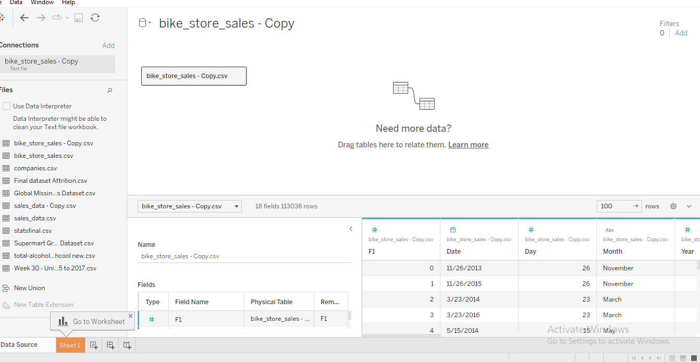
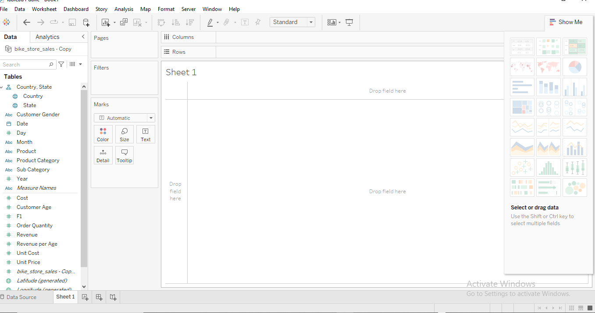
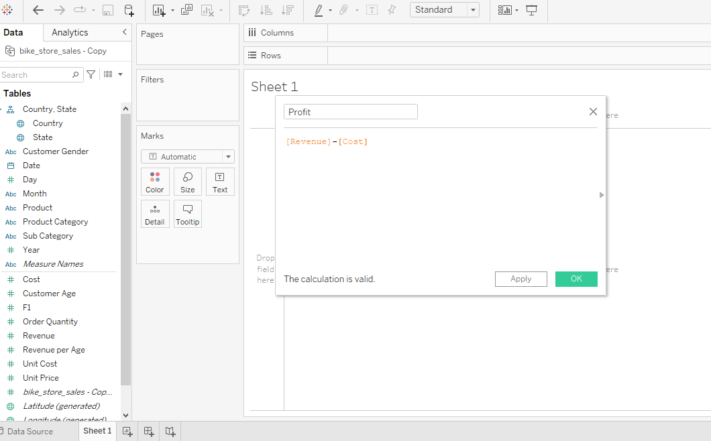

# Bike-sales-performance-analysis

## INTRODUCTION 
This is an analysis of Bike store sales. The data contains the following columns: Date, month and year of the sales, customer age, gender, country, state, product category, subcategory, order quantity, unit cost, unit price, cost of product, Revenue and revenue per age.

 **DISCLAIMER**; This is not a real company data, but data compiled by Kaggle for learning purposes.

**Problem Statement**;

•	Determine the market demand for products category and how it varies by Countries.

•	Identify the profit generated by product category and know which product category generate high profit and low profit.

•	Identify the year that generate more revenue for the company.

•	Identify the profit generated per age group.

•	Identify the day of the week that generate more profit.

•	Identify the customer gender that patronized the business more.

•	Determine the year that have more product Category demand.

**Skills and concepts demonstrated**:

***Tableau concepts like***:

•	Creating columns for calculations for profit, age groups and weekdays.

•	Use data interpreter to cleaned inconsistent and dirty data

•	Measures

•	Filters

•	Sorting

•	Labels

•	Colors

•	Data visualization

***Data Source***:

The data used for this work was gotten from Kaggle online data company.

## Uploading data into Tableau from data source

## Tableau interface with data ready to create visuals

## View of calculated field creating column for profit

**INSIGHTS**

•	United State has the highest demand per product category while Germany has the lowest demand per product category

•	Bike account for the majority of the sales as product category and generate profit of $20,582,478 while clothing generates the lowest profit of $2,846,639.

•	2015 Generate the highest Revenue of $20,042,682 

•	Adult generates the highest profit of $16,357,609 while seniors generate the lowest profit of $138,293

•	Saturday generates the highest profit of $ 4,762,895 for the day of the week while Friday generates the lowest of $4,544,275 (Day of the week are represented by number 1 to 7)

1 = Sunday, 2= Monday, 3= Tuesday, 4=Wednesday, 5= Thursday, 6 = Friday, 7=Saturday.

**RECOMMENDATION**

•	The business is performing well as the major product category it is known for (Bike) is generating more revenue and profit. However, there is room for improvement as the other type 

product categories (clothing and accessories) are not doing well, strategies to increase sales should be made like more advert and discount for them.

•	In the country that has lower sales effort should be made to partner with their local organization which will help in creating more awareness for the product.

•	Gather customer feedback about the product category and get their experience about the product and services. This information will help in identify areas for improvement.

